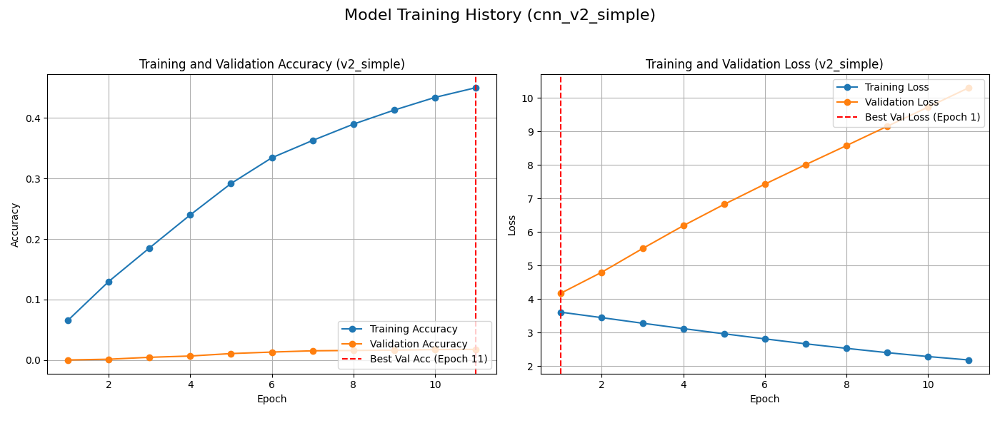

# Urdu Handwritten Character Recognition CNN

This repository documents the process of building and training a Convolutional Neural Network (CNN) to recognize handwritten Urdu characters using the UHAT dataset. The project involved several iterations, starting from basic CNNs and culminating in a successful implementation based on a specific research paper architecture.

**Current Date:** May 5, 2025

## Dataset

This project uses the **UHAT (Urdu Handwritten Text Dataset)**. The dataset file (`uhat_dataset.npz`) containing the training and testing images/labels is required to run the code.

**IMPORTANT:** The dataset file (`uhat_dataset.npz`) is **not included** in this repository due to its potential size and distribution restrictions.

**How to Obtain the Dataset:**
* *Kaggle*
    * "You can download the dataset from [https://www.kaggle.com/datasets/hazrat/uhat-urdu-handwritten-text-dataset]."
* Once obtained, place the `uhat_dataset.npz` file preferably within a `data/` subdirectory in the project's root folder, or update the `dataset_path` variable in the Python scripts accordingly.

## Project Structure

* `datacheck.py`: A utility script to visualize samples from the dataset splits (training, validation, test) to check for potential issues.
* `v1_basic_nn.py`: Represents early attempts using simpler CNN architectures. These models typically exhibited severe overfitting, as shown in `v1.png`.
* `v2_cnn.py`: Represents more complex CNNs developed through iterative refinement (e.g., adding layers, Batch Norm, Data Augmentation, L2 regularization, tuning learning rates). Despite extensive modifications, these failed to overcome a persistent overfitting pattern where validation loss exploded after the first epoch.
* `v3_cnn_paper.py`: **(Successful Model)** Implements the final, successful CNN architecture based on a research paper description. This model features 10 sequential Convolutional layers with increasing filters (16*(i+1)), Batch Normalization, and ReLU, but notably **no pooling layers**. This architecture, combined with careful training parameters, achieved benchmark results.
* `requirements.txt`: Lists the required Python packages.
* `.gitignore`: Specifies files intentionally untracked by Git (like data files, virtual environments).
* `v1.png`: Plot illustrating the typical overfitting behaviour (increasing validation loss) observed with earlier models (`v1_basic_nn.py` / `v2_cnn.py`).
* `v3.png`: Plot illustrating the successful training history (decreasing validation loss, high accuracy) of the final model (`v3_cnn_paper.py`).

## Requirements

* Python 3.9+
* TensorFlow (v2.16.2 used during development)
* NumPy
* Matplotlib
* Scikit-learn (for `train_test_split`)

You can install the required packages using pip:
```bash
pip install -r requirements.txt 

```

## Usage

1.  Obtain the dataset (`uhat_dataset.npz`) as described in the "Dataset" section and place it appropriately. Update the `dataset_path` variable in the scripts if necessary.
2.  Install requirements:
    ```bash
    pip install -r requirements.txt
    ```
3.  Run the successful model (`v3_cnn_paper.py`):
    ```bash
    python v3_cnn_paper.py
    ```
    This script will load the data, preprocess it, build the 10-layer CNN, train it using Adam with learning rate decay and Early Stopping (saving the best model based on validation loss), evaluate it on the test set, and display training history plots.
4.  (Optional) Run data check (`datacheck.py`):
    ```bash
    python datacheck.py
    ```
    This will display sample images from the training, validation (derived from split), and test sets.

## Results

The initial CNN attempts (`v1_basic_nn.py`, `v2_cnn.py`) struggled significantly with immediate overfitting on the validation set, despite various regularization techniques.

The breakthrough came with implementing the architecture described in `v3_cnn_paper.py`. This model, featuring 10 Conv-BN-ReLU blocks without pooling, successfully trained and generalized well.

**The final model (`v3_cnn_paper.py`) achieved approximately 94.7% accuracy on the test set.**

## Training History Plots

**v1 - Typical Overfitting:**
*(The plot generated by `v1_basic_nn.py` typically shows:
Training accuracy increasing and training loss decreasing (the model learns the training data).
Validation accuracy stalling or even decreasing, while *validation loss starts increasing after an initial drop or right from the beginning. This divergence between training and validation curves is the classic sign of overfitting, which was the main challenge with the earlier models)*


**v2 - Simplified CNN Overfitting Example:**
*(This plot is from the `cnn_v2_simple` model. It represents the typical failure mode seen in earlier attempts, even with data augmentation and a low learning rate. Note how validation loss (orange) increases almost immediately after the first epoch while training loss (blue) decreases, indicating severe overfitting and failure to generalize.)*



**v3 - Successful Model:**
*( The plot visualizes the training history of the successful 10-layer CNN model (`v3_cnn_paper.py`). It showcases effective learning and generalization, contrasting significantly with the earlier overfitting attempts:

* **Accuracy Plot (Left Side):**
    * You'll see the **Training Accuracy** (typically blue) rising quickly towards 1.0 (100%), showing the model is effectively learning the data it's trained on.
    * Importantly, the **Validation Accuracy** (typically orange) also rises significantly and reaches a high value (e.g., >90%), plateauing near the training accuracy. The relatively small gap between the training and validation curves indicates that the model is generalizing well to unseen data and not overfitting excessively. The dashed red line highlights the epoch where the highest validation accuracy was recorded.

* **Loss Plot (Right Side):**
    * The **Training Loss** (typically blue) decreases steadily towards a very low value.
    * Critically, the **Validation Loss** (typically orange) also **decreases significantly** for the first several epochs (e.g., epochs 1-6). This is the key indicator that the model is successfully learning features that generalize to new data. It reaches a distinct minimum point (marked by the dashed red line) before it might start to plateau or slowly increase.
    * The `EarlyStopping` callback, combined with `restore_best_weights=True`, ensures that the model saved and evaluated is the one from the epoch with this minimum validation loss, capturing its peak generalization performance.

* **Overall:** Unlike the plots from earlier attempts where validation loss exploded upwards immediately, this plot demonstrates a healthy training process where the model improves on both training and validation data concurrently for a period. This successful learning and generalization phase is what led to the final high test accuracy of ~94.7%.)*


